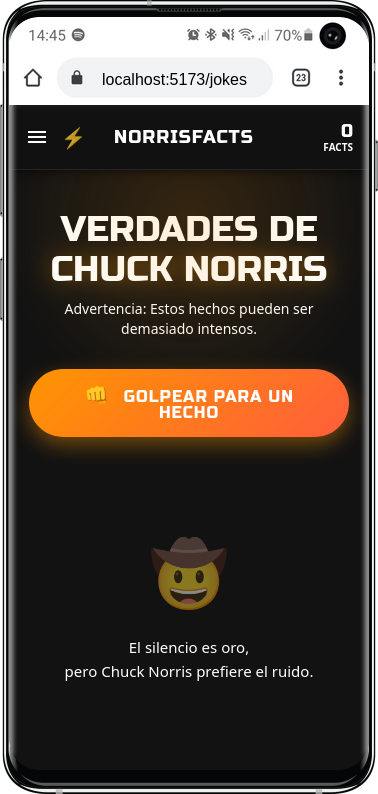
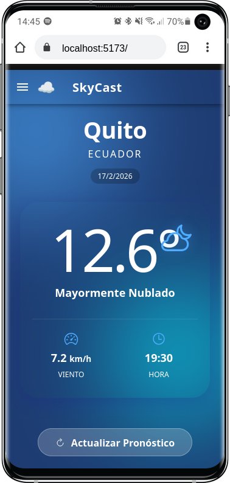

# Ionic API Explorer 🚀

Una aplicación moderna y escalable construida con **Ionic 8** y **Vue 3** que demuestra cómo consumir múltiples APIs externas utilizando arquitectura limpia y **Pinia** para la gestión del estado.


<p align="center">
  
  
  
</p>

## ✨ Características

Este proyecto incluye ejemplos prácticos de integración con tres APIs diferentes, cada una con su propia página y diseño premium:

### 1. Pokémon
-   Buscador en tiempo real de Pokémon.
-   Visualización de tarjetas con sprites, tipos y colores dinámicos según el tipo de Pokémon.
-   Animaciones de entrada y feedback visual.

### 2. Norris Facts (Chuck Norris IO)
-   Generador aleatorio de hechos de Chuck Norris.
-   Diseño con estilo "punch" y animaciones divertidas.
-   Historial de hechos consultados en la sesión.

### 3. SkyCast (Open-Meteo)
-   Consulta del clima en tiempo real para Quito, Ecuador (extensible).
-   Diseño **Glassmorphism** sobre fondos degradados animados.
-   Visualización clara de temperatura, viento y hora.

## 🛠️ Stack Tecnológico

-   **Framework UI**: [Ionic Framework 8](https://ionicframework.com/)
-   **Core**: [Vue 3](https://vuejs.org/) (Composition API & Script Setup)
-   **Estado**: [Pinia](https://pinia.vuejs.org/)
-   **Lenguaje**: [TypeScript](https://www.typescriptlang.org/)
-   **Build Tool**: [Vite](https://vitejs.dev/)
-   **Iconos**: [Ionicons](https://ionic.io/ionicons)

## 📂 Arquitectura del Proyecto

El proyecto sigue una estructura limpia para asegurar la escalabilidad:

```
src/
├── services/       # Capa de servicios para llamadas API externas
│   └── apiService.ts
├── store/          # Gestión de estado (Stores de Pinia)
│   ├── usePokeStore.ts
│   ├── useJokeStore.ts
│   └── useWeatherStore.ts
├── views/          # Páginas de la aplicación
│   ├── PokemonPage.vue
│   ├── JokesPage.vue
│   └── WeatherPage.vue
├── router/         # Configuración de rutas
└── App.vue         # Componente raíz y menú lateral
```

### Clean Code
Se ha implementado una capa de servicio (`apiService.ts`) que centraliza todas las peticiones HTTP (`axios`). Los Stores de Pinia consumen este servicio, manteniendo la lógica de negocio separada de los detalles de implementación de la API.

## 🚀 Instalación y Uso

1.  **Clonar el repositorio**:
    ```bash
    git clone https://github.com/tu-usuario/ionic-project-apis.git
    cd ionic-project-apis
    ```

2.  **Instalar dependencias**:
    ```bash
    npm install
    ```

3.  **Ejecutar en desarrollo**:
    ```bash
    npm run dev
    # O para exponer en red local:
    npx vite --host
    ```

4.  **Compilar para producción**:
    ```bash
    npm run build
    npx cap sync
    ```

## 🌐 APIs Utilizadas

-   [PokéAPI](https://pokeapi.co/) - The RESTful Pokémon API
-   [Chuck Norris IO](https://api.chucknorris.io/) - JSON API for hand curated Chuck Norris facts
-   [Open-Meteo](https://open-meteo.com/) - Free Weather API

## 👤 Autor

**Israel Mendoza**

---
Hecho con 💙 y código limpio.
